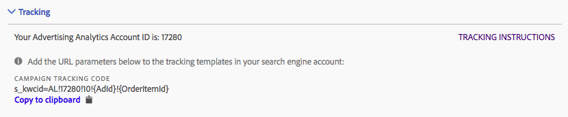

# Spårning: Manuellt läge och autoläge

Spårning avgör hur sökmotordata spåras av din Adobe Analytics-implementering. Detta är ett nödvändigt steg för att utöka Adobe Analytics data med sökmotordata.

Två spårningslägen stöds: Automatiskt läge och Manuellt läge.

## Spårning av automatiskt läge {#concept_C4C6107838C947CFBB7F4E0CB94264F0}

I det automatiska läget kan du låta Advertising Cloud Engine bestämma hur sökmotordata ska hanteras. Detta är det enklaste sättet, men kanske inte ger den bästa integrerade datauppsättningen.

Därför måste du markera kryssrutan Bekräftelse när du väljer Auto-läge innan du kan spara kontoinställningen.

Observera att du ansvarar för följande åtgärder när du konfigurerar ett sökmotorkonto i Automatiskt läge:

* Parametern `s_kwcid` och värdet läggs till i kontospårningsmallarna eller URL:erna för landningssidan i det konto som läggs till. Den infogas i slutet av URL:en. Ytterligare åtgärder kan krävas från din sida om webbservern kräver ett visst nyckel=värde-par i slutet av URL:en ELLER en uppdatering som stöder ett nytt nyckel=värde-par i URL:en. **Det är ditt ansvar att se till att de URL-parametrar som läggs till behålls korrekt på den slutliga landningssidan.**
* Dessutom kan nyckelord infogas i landnings-URL:en som en del av `s_kwcid`-värdet. Om de innehåller specialtecken eller symboler måste du bekräfta att webbservern kan hantera dessa tecken. Exempel: Ett vanligt specialtecken är&quot;+&quot;, som används i nyckelorden&quot;Bred Match Modified&quot;.

>[!IMPORTANT]
>
>Läs mer om huruvida du bör lägga till parametern `s_kwcid` i din [skyddsprofil för innehåll](https://experienceleague.adobe.com/docs/id-service/using/reference/csp.html).

## Manuell lägesspårning {#concept_87B28BA9E7F84BA5972F69E6F3482A33}

I det manuella läget måste du ange hur sökmotordata ska hanteras av dataintegreringsprocessen i Advertising Analytics.

### Lägg till manuell spårning till Google-konto {#section_41C1EB1AEB034544A5BC291F53C05C67}

Strängen som behöver läggas till i ditt Google-konto visas nedan. Du måste lägga till strängen i alla spårningsmallar som används i hela kontot.

>[!IMPORTANT]
>
>`<Advertising Analytics ID>`-värdet (i **bold** nedan) är generiskt och **måste ersättas med din specifika konto-ID-sträng**. Du kan hämta din specifika konto-ID-sträng från inställningsskärmen för kontot under avsnittet Spårning.

**Spårningssträng för kampanjer:**

```
s_kwcid=AL! 
<b><Advertising Analytics ID></b>!3!{creative}!{matchtype}!{placement}!{network}!{product_partition_id}!{keyword}
```


Exempel på spårningskoder i olika spårningsmallformat:

**`{lpurl}`**

```
{lpurl}?s_kwcid=AL!9999!3!{creative}!{matchtype}!{placement}!network}!{product_partition_id}!{keyword}
```

**`{lpurl}`med ytterligare URL-parameter**

```
{lpurl}?campaign=PPC&s_kwcid=AL!9999!3!{creative}!{matchtype}!{placement}!network}!{product_partition_id}!{keyword}
```

**Tredje part (DoubleClick)`{unescapedlpurl}`**

```
https://clickserve.dartsearch.net/link/click?{_dssagcrid}&{_dssftfiid}&ds_e_adid={creative}&ds_e_matchtype={ifsearch:search}{ifcontent:content}&ds_e_device={device}&ds_e_network={network}&{ifpla:ds_e_product_group_id={product_partition_id}&ds_e_product_id={product_id}&ds_e_product_merchant_id={merchant_id}&ds_e_product_country={product_country}&ds_e_product_language={product_language}&ds_e_product_channel={product_channel}&ds_e_product_store_id={product_store_id}}&ds_url_v=2&ds_dest_url={unescapedlpurl}?s_kwcid=AL!9999!3!{creative}!{matchtype}!{placement}!{network}!{product_partition_id}!{keyword}
```

**Tredje part (DoubleClick)`{lpurl}`**

Om URL:en går igenom en omdirigering och inte använder ett unescape-värde måste du koda strängen tillräckligt många gånger så att den fortsätter genom omdirigeringen till den slutliga URL:en för landningssidan.

```
https://clickserve.dartsearch.net/link/click?{_dssagcrid}&{_dssftfiid}&ds_e_adid={creative}&ds_e_matchtype={ifsearch:search}{ifcontent:content}&ds_e_device={device}&ds_e_network={network}&{ifpla:ds_e_product_group_id={product_partition_id}&ds_e_product_id={product_id}&ds_e_product_merchant_id={merchant_id}&ds_e_product_country={product_country}&ds_e_product_language={product_language}&ds_e_product_channel={product_channel}&ds_e_product_store_id={product_store_id}}&ds_url_v=2&ds_dest_url={lpurl}?s_kwcid%3DAL!9999!3!{creative}!{matchtype}!{placement}!{network}!{product_partition_id}!{keyword}
```

### Lägg till manuell spårning till Bing-konto {#section_094F8ACA493C4D65B1F54A695558EBF2}

Strängen som behöver läggas till i ditt Bing-konto visas nedan. Du måste lägga till strängen i alla de slutliga URL-suffixen som används i hela ditt konto.

>[!IMPORTANT]
>
>`<Advertising Analytics ID>`-värdet (i **bold** nedan) är generiskt och **måste ersättas med din specifika konto-ID-sträng**. Du kan hämta din specifika konto-ID-sträng från inställningsskärmen för kontot under avsnittet Spårning.

**Spårningssträng för kampanjer:**

```
s_kwcid=AL!<Advertising Analytics ID>!10!{AdId}!{OrderItemId} 
```



Exempel på spårningskoder i olika slutliga URL-suffixformat:

**{lpurl}**

```
{lpurl}?s_kwcid=AL!9999!10!{AdId}!{OrderItemId}
```

**`{lpurl}`med ytterligare URL-parameter**

```
{lpurl}?campaign=PPC&
s_kwcid=AL!9999!10!{AdId}!{OrderItemId}
```

**Tredje part (DoubleClick)`{unescapedlpurl}`**

```
https://clickserve.dartsearch.net/link/click?{_dssagcrid}&{_dssftfiid}&ds_e_adid={creative}&ds_e_matchtype={ifsearch:search}{ifcontent:content}&ds_e_device={device}&ds_e_network={network}&{ifpla:ds_e_product_group_id={product_partition_id}&ds_e_product_id={product_id}&ds_e_product_merchant_id={merchant_id}&ds_e_product_country={product_country}&ds_e_product_language={product_language}&ds_e_product_channel={product_channel}&ds_e_product_store_id={product_store_id}}&ds_url_v=2&ds_dest_url={unescapedlpurl}?s_kwcid=AL!9999!10!{AdId}!{OrderItemId}
```

**Tredje part (DoubleClick)`{lpurl}`**

Om URL:en går igenom en omdirigering och inte använder ett unescape-värde måste du koda strängen tillräckligt många gånger så att den fortsätter genom omdirigeringen till den slutliga URL:en för landningssidan.

```
https://clickserve.dartsearch.net/link/click?{_dssagcrid}&{_dssftfiid}&ds_e_adid={creative}&ds_e_matchtype={ifsearch:search}{ifcontent:content}&ds_e_device={device}&ds_e_network={network}&{ifpla:ds_e_product_group_id={product_partition_id}&ds_e_product_id={product_id}&ds_e_product_merchant_id={merchant_id}&ds_e_product_country={product_country}&ds_e_product_language={product_language}&ds_e_product_channel={product_channel}&ds_e_product_store_id={product_store_id}}&ds_url_v=2&ds_dest_url={lpurl}?s_kwcid%3DAL!9999!10!{AdId}!{OrderItemId}
```
