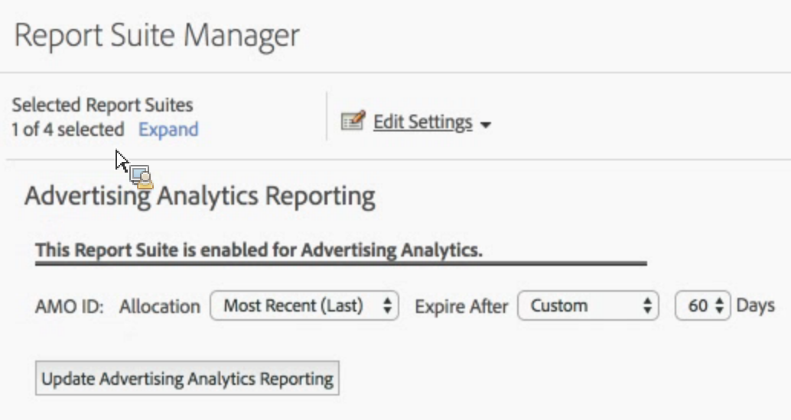

# Aktivera rapportsvit för Advertising Analytics

För att kunna se eventuella sökdata för Advertising Analytics i Analytics måste ni konfigurera varje Experience Cloud-mappad rapportsvit för Advertising Analytics-rapportering.

1. [Kartlägg din rapportsvit för en organisation](https://docs.adobe.com/content/help/en/core-services/interface/about-core-services/report-suite-mapping.html).
1. Navigera till **[!UICONTROL Admin]** > **[!UICONTROL Report Suites]**.

1. Välj den rapportsvit som är mappad till din Experience Cloud-organisation.
1. Klicka på **[!UICONTROL Edit Settings]** > **[!UICONTROL Advertising Analytics Configuration]**.

   

   > [!IMPORTANT] AMO ID refererar till Adobe Advertising Cloud-variabeln som sökdata ska infogas i.

1. Ange variabelallokering och förfallodatum som du vill att variabeln AMO ID ska använda. Med konverteringsvariabler (eVars) kan Adobe Analytics attribuera success-händelser till specifika variabelvärden. Ibland påträffar variabler mer än ett värde innan en success-händelse inträffar. I dessa fall avgör allokeringen vilket variabelvärde som får kredit för händelsen.

   | Inställning | Definition |
   |--- |--- |
   | Ursprungligt värde (första) | Det första värdet som visas får fullständig allokeringskredit, oavsett vilka efterföljande värden som används för variabeln. |
   | Senaste (senaste) | Det senaste värdet som har identifierats får fullständig allokeringskreditering för händelsen success, oavsett vilka variabler som sparades innan. |
   | Förfaller efter | Gör att du kan ange en tidsperiod eller händelse efter vilken eVar-värdet förfaller (d.v.s. inte längre får kredit för lyckade händelser).  Om en success-händelse inträffar efter eVar-förfallodatumet får värdet None krediter för händelsen (ingen eVar var aktiv). |

1. Klicka **[!UICONTROL Enable Advertising Analytics Reporting]** (första gången) eller **[!UICONTROL Update Advertising Analytics Reporting]** (efterföljande gånger). Din rapportsvit är nu redo att ta emot data från Advertising Analytics Search. Du är inte redo att [skapa annonskonton](/help/integrate/c-advertising-analytics/c-adanalytics-workflow/aa-create-ad-account.md).

