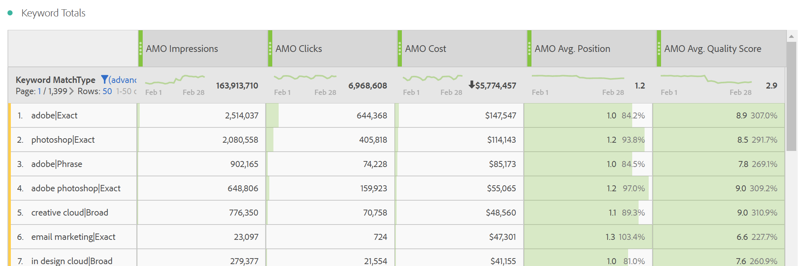
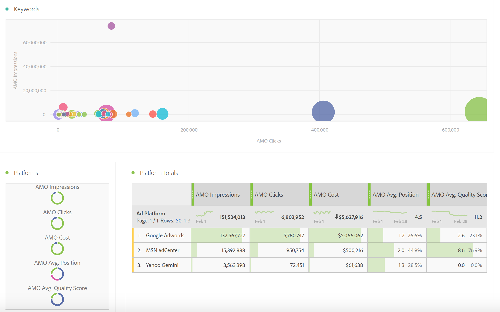

# Rapport om reklamdata

Den här artikeln innehåller information om Analysis Workspace-rapporten och rapporteringen i Report Builder.

>[!NOTE]
>
>Du bör vänta minst 24 timmar innan sökmotordata fylls i i era Analytics-rapporter. Observera också att analysrapporter inte returnerar data för timgranularitet eftersom Advertising Cloud-data inte stöder timgranularitet.

## Betalsökrapport {#section_8173F42B2C784F41B9FD82CBB66F9ADF}

Den här rapporten ger alla som implementerar sökmotorintegration tillgång till sökmotordata i Analytics. Du kommer åt den via **[!UICONTROL Workspace]** > **[!UICONTROL Reports]** > **[!UICONTROL Acquisition]** > **[!UICONTROL Advertising Analytics: paid search]**

>[!NOTE]
>
>Sökrapporten Betald visas för alla kunder, även om du inte har implementerat några Advertising-konton. Om du försöker öppna den betalda sökrapporten för ett företag som inte har etablerats visas ett felmeddelande om att du inte har konfigurerat något sökmotorkonto. Välj **[!UICONTROL Configure Now]**, som tar dig till skärmen [Advertising-kontoinställningar](/help/integrate/c-advertising-analytics/c-adanalytics-workflow/aa-create-ad-account.md).

       

| Tabell/visualisering | Beskrivning |
|--- |--- |
| Advertising Trends | Översikt över dagliga trender för AMO Impressions, AMO Clicks och AMO Cost. |
| Annonsplattformar | Diagram över kostnaden för de två främsta plattformarna (Google Ads, Microsoft Advertising). |
| Summor för annonsplattform | Frihandstabell över de översta plattformarna uppdelade efter AMO Impressions, AMO Clicks, AMO Costs, AMO Avg. Position, AMO Avg. Quality Score. |
| Konton | Staplad kostnadsyta. |
| Kontosummor | Frihandstabell för de översta kontona uppdelade efter associerade mått. |
| Kampanjer | Stapeldiagram över kampanjkostnader. |
| Kampanjsummor | Frihandstabell över de främsta kampanjerna, uppdelad efter associerade mätvärden. |
| Grupper | Trädkarta över kostnad. |
| Gruppsummor | Frihandsregister över de främsta annonsgrupperna, uppdelat efter associerade mått. |
| Annonser | Vågrätt stapeldiagram med visningar, klickningar och kostnader. |
| Summor för annonser | Frihandstabell för de översta annonserna, uppdelad efter associerade mätvärden. |
| Nyckelord | Punktdiagram över visningar, klickningar och kostnader för alla kombinationer av nyckelord/matchningstyper. |
| Summor för nyckelord | Frihandstabell för de översta kombinationerna av nyckelord/matchningstyp, uppdelad efter associerade mått. |

## Report Builder {#section_8E0371CF81144C33990D909685D1726E}

Så snart du har skapat ett Advertising Analytics-konto blir Advertising Analytics-rapporten tillgänglig.
