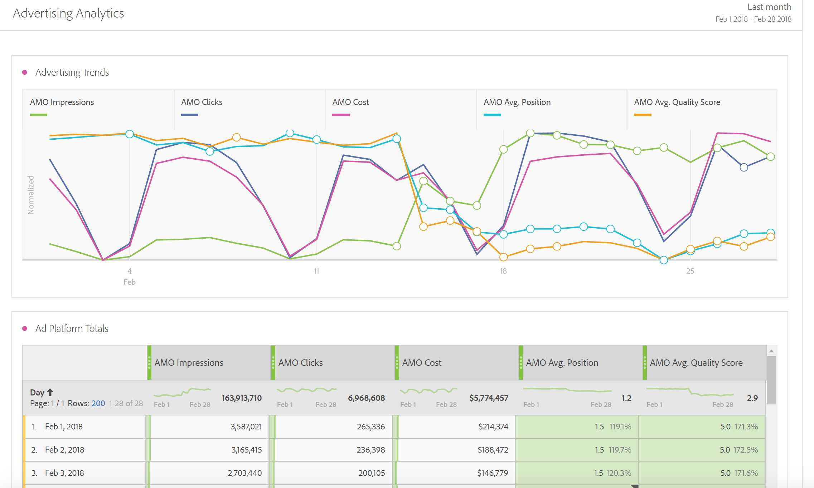

# A guide to Advertising Analytics

Med Advertising Analytics kan du se alla dina Google- och Bing Paid Search-data sida vid sida, inifrån Adobe Analytics. Tidigare måste alla Google AdWords/DFA- och Microsoft Bing Ads-data visas i Adobe Advertising Cloud (AMO) eller i Google/Bing. Du kan nu hämta följande data från Adobe Analytics: Impressions, Click, Costs data directly from the search engines as as a AMO ID Instances (Click Instances). Kvalitetsresultat och genomsnittliga positioner samlas inte längre in eftersom Google ersatt dessa värden i september 2019.

>[!NOTE]
>
>Yahoo Gemini ingick i Microsoft Bing den 31 mars 2019. Detta innebär att annonskontoalternativet Yahoo Gemini inte längre är tillgängligt.

Genom att samla data från sökmotorerna i Adobe Analytics kan du analysera dessa data med hjälp av Analysis Workspace. Den här analysen underlättas av en ny mall för [Paid Search Performance](/help/integrate/c-advertising-analytics/c-adanalytics-workflow/aa-report-ad-data-an.md) i Workspace.

Denna integrering riktar sig till följande målgrupper:

* Den **analytiker** som behöver samla in resultatrapporter för Paid Search Marketer.
* Den **Paid Search Marketer** som söker svar på följande frågor: Hur mycket trafik skickar jag till vår webbplats och konverterar kunderna? Vilka är mina kostnadseffektiva annonskampanjer?

## Förutsättningar {#section_C25E0CA3474C4EDEAEAA9A5B8AAC9299}

* Advertising Analytics finns endast för SKU:erna Adobe Analytics [Select](https://www.adobe.com/se/data-analytics-cloud/analytics/select.html), [Prime](https://www.adobe.com/se/data-analytics-cloud/analytics/prime.html) och [Ultimate](https://www.adobe.com/se/data-analytics-cloud/analytics/ultimate.html).

* Den här funktionen är tillgänglig för kunder som inte använder Advertising Cloud eller AMO.
* Du måste vara Adobe Analytics-administratör för att få tillgång till Advertising Analytics. Därefter kan du [ge icke-administratörer åtkomstbehörigheter](/help/integrate/c-advertising-analytics/overview.md#section_FCC58EB635954A32990D4E67B52B4369).
* För alla rapportsviter där du vill visa Google-/Bing-sökdata måste du [aktivera dessa rapportsviter för Advertising Analytics](/help/integrate/c-advertising-analytics/c-adanalytics-workflow/aa-provision-rs.md) ( **[!UICONTROL Admin]** > **[!UICONTROL Edit Settings]** > **[!UICONTROL Advertising Analytics Configuration]**).

* Du behöver inloggningsuppgifter för en användare med redigeringsbehörighet för sökkonton som du vill integrera med Adobe Analytics, till exempel ett Google-konto-ID och ett lösenord.
* När det gäller Bing Ads behöver du också Bing Customer ID.
* Om du använder Internet Explorer 11 (eller tidigare) kommer du inte att kunna [konfigurera ett annonskonto](/help/integrate/c-advertising-analytics/c-adanalytics-workflow/aa-create-ad-account.md) för någon av de tre sökmotorerna. Använd i stället andra webbläsare.

## Behörighet för Advertising Analytics {#section_FCC58EB635954A32990D4E67B52B4369}

Analyserna har två behörigheter som automatiskt tilldelas Analytics-administratörer. Administratörer kan sedan välja att ge dessa behörigheter till icke-administratörer.

<table id="table_86256AD8B4554F369439A8FDF2F545E1"> 
 <thead> 
  <tr> 
   <th colname="col1" class="entry"> Behörighet </th> 
   <th colname="col2" class="entry"> Definition </th> 
   <th colname="col3" class="entry"> Bevilja behörighet i Adobe Analytics </th> 
   <th colname="col4" class="entry"> Bevilja behörighet om du är inloggad på Adobe Experience Cloud </th> 
  </tr>
 </thead>
 <tbody> 
  <tr> 
   <td colname="col1"> 
Hantering av Advertising Analytics 
 </td> 
   <td colname="col2"> 
Tillåter användare att konfigurera/redigera/visa annonssökkonton. 
 </td> 
   <td colname="col3"> Administratör &gt;  Alla administratörer   &gt;  Användarhantering &gt;  Grupper &gt;  Redigera all rapportåtkomst &gt;  Anpassa analysverktyg &gt;  Advertising Analytics Management </td> 
   <td colname="col4"> Logga in på adminconsole.adobe.com &gt;  Products &gt;  Product Profile &gt;  fliken Permissions &gt;  Analytics Tools &gt;  Advertising Analytics Management </td> 
  </tr> 
  <tr> 
   <td colname="col1"> 
Konfiguration av Advertising Analytics 
 </td> 
   <td colname="col2"> 
Användaren kan konfigurera rapportsviter som ska etableras för Advertising Analytics. 
 </td> 
   <td colname="col3"> Administratör &gt;  Alla administratörer   &gt;  Användarhantering &gt;  Grupper &gt;  Redigera all rapportåtkomst &gt;  Anpassa Report Suite-verktyg &gt;  Advertising Analytics Configuration </td> 
   <td colname="col4"> Logga in på adminconsole.adobe.com &gt;  Products &gt;  Product Profile &gt;  fliken Permissions &gt;  Report Suite Tools &gt;  Advertising Analytics Configuration </td> 
  </tr> 
 </tbody> 
</table>

## Dimensioner och mätvärden för Advertising Analytics {#section_C0DF4A08EA9E46ADABE9E465AFC11E32}

Advertising Analytics lägger till följande dimensioner och mätvärden i Analysis Workspace, Reports &amp; Analytics, Report Builder och Analytics Reporting API.

**Dimensioner**

>[!IMPORTANT]
>
>Den här integreringen skapar en ny uppsättning dimensioner genom klassificeringar av variabeln AMO ID. Dessa nya dimensioner påverkar inte och ändrar inte era befintliga marknadsföringskanaler eller variabeldimensioner för kampanjspårning. AMO-ID:t är kopplat till en besökares profil när en besökare landar på webbplatsen från en Paid Search-annons. AMO-dimensionerna kan därför användas för att bryta ned både de AMO-mätvärden som den här integreringen ger men även alla data som besökaren tar in längre fram i kedjan (besök, besökare, sidvisningar, avhoppsfrekvens, order, intäkter, anpassade händelser etc.). De kan också delas upp efter andra dimensioner vid rapportering av andra mätvärden på plats.
>
>Klassificeringarna för dessa mätvärden uppdateras dagligen. Om du ändrar metadata i en sökmotor kanske du inte ser dessa ändringar förrän följande dag när klassificeringarna uppdateras.

| Klassificeringsnamn (dimension) | Definition |
|--- |--- |
| Matchningstyp för nyckelord (AMO ID) | Nyckelordsmatchningstypen. Värdena är vanligtvis breda, fras, exakta eller inga värden om annonstypen inte har någon matchningstyp. |
| Annonsplattform (AMO ID) | Sökmotorns namn. Värdena kan vara Google AdWords eller Microsoft Bing Ads. |
| Konto (AMO-ID) | Namnet på sökmotorkontot som spåras. |
| Kampanj (AMO-ID) | Namnet på kampanjen i sökmotorkontot. |
| Annonsgrupp (AMO-ID) | Namnet på annonsgruppen i dina sökmotorkampanjer. |
| Annons (AMO-ID) | Annonsrubrik + Annonsbeskrivning som används i annonsen. |
| Nyckelord (AMO-ID) | Nyckelordsvärdet från ditt sökmotorkonto. |
| Matchningstyp (AMO-ID) | Nyckelordsmatchningstypen som tilldelats nyckelordet. Värdena är vanligtvis breda, fras, exakta eller inga värden om annonstypen inte har någon matchningstyp. |
| Annonstyp (AMO-ID) | Den typ av annons som hanteras, och som vanligtvis är &quot;Textannons&quot;. |
| Annonsrubrik (AMO-ID) | Rubrikobjektet som används i din annons. |
| Annonsbeskrivning (AMO-ID) | Objektet Annonsbeskrivning som används i din annons. |
| Webbadress för annonsvisning (AMO-ID) | Det webbplatsobjekt för annonsvisning som används i annonsen. |
| Webbadress för annons (AMO-ID) | Landningssidans webbadress eller den slutliga webbadressen som tilldelats din annons. |
| Nätverk (AMO-ID) | Det nätverk där annonsen hanteras. För Advertising Analytics är det här värdet alltid &quot;Search&quot;. |
| Placering (AMO-ID) | Den hanterade placeringswebbplatsen (för innehållsnätverk). Endast hanterade placeringar använder den här dimensionen. |
| Produktmål (AMO-ID) | Namnet på produktmålet som används på PLA-annonser (inte den faktiska produkt som köpts). |
| Optimering (AMO-ID) | Detta används inte av Advertising Analytics. Det används endast av Advertising Cloud-kunder. |
| Enhet (AMO-ID) | Används inte i dag. Platshållare för potentiell framtida produktförbättring av angiven målenhetstyp (t.ex. mobil, dator) för annons (inte besökarens faktiska enhet). |

**Mätvärden**

>[!IMPORTANT]
>
>De mätvärden som tillhandahålls av Advertising Analytics (listas nedan) är data på sammanfattningsnivå från sökmotorerna. De är inte kopplade till besökarprofilerna i Analytics. De är bara kopplade till variabeln AMO ID och dess tillhörande klassificeringsdimensioner. Därför bör de inte rapporteras för andra dimensioner/segment än dem som baseras på AMO ID-dimensionerna. I annat fall visas nollor för data i Analytics. Du kan inkludera dem i beräknade värden med andra mätvärden, men dessa beräknade värden får även bara delas upp efter AMO ID-dimensionerna.
>
>Dessa mätvärden är data som hämtas dagligen och de har inte data för den aktuella dagen. De ska inte heller rapporteras detaljrikare än dagligen.
>
>Det finns ett mått för AMO ID-instanser som ställs in när AMO-ID:t ställs in på en landningssida (dvs. en klickfrekvens). Detta mätresultat hämtas i realtid med landningssidans träff och är tillgängligt för delningar med andra dimensioner som också anges på landningssidan.

| Mätvärdets namn | Definition |
|--- |--- |
| AMO Impressions | Antalet annonsvisningar som rapporteras av sökmotorn. |
| AMO Clicks | Antalet klick på annonser som rapporterats av sökmotorn. |
| AMO Cost | Kostnaden för varje nyckelord/annons som rapporteras av sökmotorn. |
