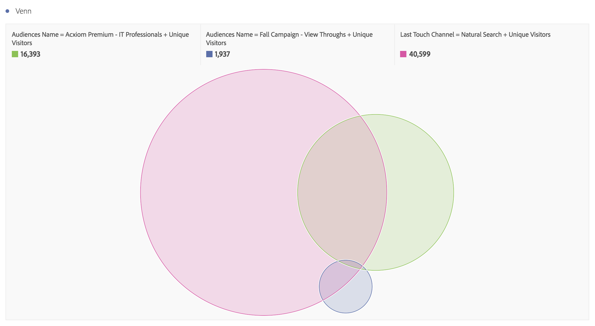

# Använd målgruppsdata i Analytics

Ni kan använda Adobe Audience Manager Audience-dimensionerna i hela Analytics. De integrerade segmenten är nya analysdimensioner som kallas publikens ID och publikens namn, och kan användas precis som andra dimensioner som samlas in med Analytics. I Dataflöden lagras publikens ID:n i kolumnen&quot;mc_audiences&quot;. Dessa dimensioner är för närvarande inte tillgängliga i Data Workbench eller LiveStream. Några exempel på hur publikens dimensioner kan utnyttjas är:

## Analysis Workspace {#workspace}

I Analysis Workspace visas Adobe Audience Manager-segmenten som två dimensioner.

1. Gå till **[!UICONTROL Workspace]**.
1. Välj måtten **[!UICONTROL Dimensions]** eller **[!UICONTROL Audience ID]** i listan med **[!UICONTROL Audience Name]**. Namnet är en användarvänlig klassificering av ID:t.

   

## Segmentjämförelse {#compare}

[Segmentjämförelse](/help/analyze/analysis-workspace/c-panels/c-segment-comparison/segment-comparison.md) identifierar de mest statistiskt signifikanta skillnaderna mellan två segment. Målgruppsdata kan användas i segmentjämförelsen på två sätt: 1) som de två segment som ska jämföras och 2) som objekt i tabellen&quot;De viktigaste Dimension-objekten&quot;.

1. Gå till **[!UICONTROL Workspace]** och välj panelen **[!UICONTROL Segment Comparison]** i den vänstra listen.

1. Sök efter [!UICONTROL Audiences Name] på menyn **[!UICONTROL Component]**.

1. Öppna [!UICONTROL Audiences Name] så att relaterade dimensionsobjekt visas.
1. Dra de målgrupper du vill jämföra till segmentjämförelseverktyget.
1. (Valfritt): Du kan även infoga andra dimensionsobjekt eller segment, upp till 2 kan jämföras.
1. Klicka på **[!UICONTROL Build]**.

   Måtten för publikens ID och namn visas automatiskt i tabellen&quot;De vanligaste Dimension-objekten&quot; eftersom de är ytterligare profildata för de två segment som jämförs.

   

## Kundresa (flöde) i Analysis Workspace {#flow}

Adobe Audience Manager segmentdata överförs till Analytics från en träffsäker nivå och representerar målgruppsmedlemskapet för en besökare vid den tidpunkten. Det innebär att en besökare kan indelas i ett segment (t.ex.&quot;Kännedom&quot;) och senare kvalificera sig för ett mer kvalificerat segment (t.ex.&quot;Övervägande&quot;). Du kan använda [Flow](/help/analyze/analysis-workspace/visualizations/fallout/fallout-flow.md) i Analysis Workspace för att visualisera den resa en besökare tar mellan olika målgrupper.

1. Gå till **[!UICONTROL Workspace]** och välj **[!UICONTROL Flow]**-visualisering från den vänstra listen.

1. Dra dimensionen [!UICONTROL Audience Name] till Flow Builder.
1. Klicka på **[!UICONTROL Build]**.
1. (Valfritt): Dra någon annan dimension till Flödesvisualiseringen för att skapa ett [interdimensionellt flöde](/help/analyze/analysis-workspace/visualizations/c-flow/multi-dimensional-flow.md).

Publiker kan också användas i [Bortfallsvisualiseringar](/help/analyze/analysis-workspace/visualizations/fallout/fallout-flow.md).

## Visualisering av Venner i Analysis Workspace {#venn}

[Vennvisualiseringar](/help/analyze/analysis-workspace/visualizations/venn.md) visar överlappningen mellan upp till 3 segment.

1. Gå till **[!UICONTROL Workspace]** och välj **[!UICONTROL Venn]**-visualisering från den vänstra listen.

1. Sök efter [!UICONTROL Audience Name] på komponentmenyn.
1. Öppna [!UICONTROL Audience Name] så att relaterade dimensionsobjekt visas.
1. Dra de målgrupper du vill jämföra till Venn-byggaren.
1. (Valfritt): Du kan även infoga andra dimensionsobjekt eller segment, upp till 3 kan jämföras.
1. Klicka på **[!UICONTROL Build]**.

## Segment Builder {#builder}

Du kan inkludera målgruppsdimensionerna i [segmentbyggaren](/help/components/segmentation/segmentation-workflow/seg-build.md) i Analytics, tillsammans med den beteendeinformation som samlas in i Analytics.

1. Gå till **[!UICONTROL Components]** > **[!UICONTROL Segments]** .
1. Klicka på **[!UICONTROL Add]** om du vill skapa ett nytt segment.
1. När du har namngett segmentet drar du dimensionen [!UICONTROL Audience Name] till panelen Definitioner.
1. (Valfritt): Lägg till andra villkor till segmentet.
1. Spara segmentet.

   

