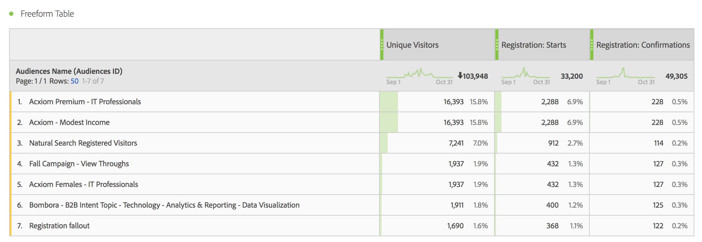
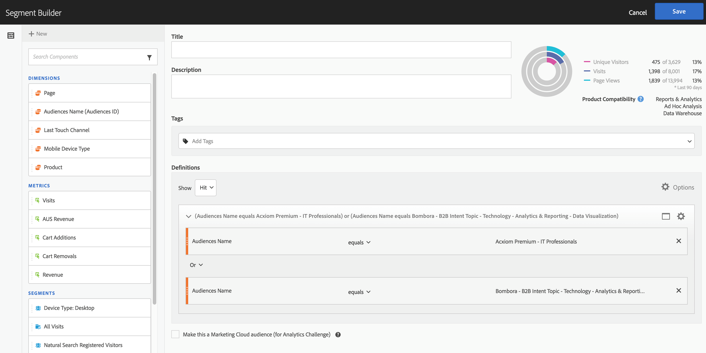

# Använd målgruppsdata i Analytics

Ni kan använda Adobe Audience Manager Audience-dimensionerna i hela Analytics. De integrerade segmenten är nya analysdimensioner som kallas publikens ID och publikens namn, och kan användas precis som andra dimensioner som samlas in med Analytics. I Dataflöden lagras publikens ID:n i kolumnen&quot;mc_audiences&quot;. Dessa dimensioner är för närvarande inte tillgängliga i Data Workbench eller livream. Några exempel på hur publikens dimensioner kan utnyttjas är:

## Analysis Workspace {#workspace}

I Analysis Workspace visas Adobe Audience Manager-segmenten som två dimensioner.

1. Gå till **[!UICONTROL Workspace]**.
1. I listan över **[!UICONTROL Dimensions]** väljer du måtten **[!UICONTROL Audience ID]** eller **[!UICONTROL Audience Name]**. Namnet är en användarvänlig klassificering av ID:t.

   

## Segmentjämförelse {#compare}

[Segmentjämförelse](https://experienceleague.adobe.com/docs/analytics/analyze/analysis-workspace/panels/segment-comparison/segment-comparison.html) Identifierar de mest statistiskt signifikanta skillnaderna mellan två segment. Målgruppsdata kan användas i segmentjämförelsen på två sätt: 1) som de två segment som jämförs och 2) som objekt i Dimensionen&quot;Objekt i den översta gruppen&quot;.

1. Gå till **[!UICONTROL Workspace]** och väljer **[!UICONTROL Segment Comparison]** från den vänstra listen.

1. Sök efter [!UICONTROL Audiences Name] i **[!UICONTROL Component]** -menyn.

1. Öppna [!UICONTROL Audiences Name]så att relaterade dimensionsobjekt visas.
1. Dra de målgrupper du vill jämföra till segmentjämförelseverktyget.
1. (Valfritt): Du kan även infoga andra dimensionsobjekt eller segment, upp till 2 kan jämföras.
1. Klicka på **[!UICONTROL Build]**.

   Måtten för publikens ID och namn visas automatiskt i tabellen&quot;Objekt i den översta Dimensionen&quot;, eftersom de är ytterligare profildata för de två segment som jämförs.

   

## Kundresa (flöde) i Analysis Workspace {#flow}

Adobe Audience Manager segmentdata överförs till Analytics från en träffsäker nivå och representerar målgruppsmedlemskapet för en besökare vid den tidpunkten. Det innebär att en besökare kan indelas i ett segment (t.ex.&quot;Kännedom&quot;) och senare kvalificera sig för ett mer kvalificerat segment (t.ex.&quot;Övervägande&quot;). Du kan använda [Flöde](https://experienceleague.adobe.com/docs/analytics/analyze/analysis-workspace/visualizations/fallout/fallout-flow.html) i Analysis Workspace för att visualisera den resa en besökare tar mellan olika målgrupper.

1. Gå till **[!UICONTROL Workspace]** och väljer **[!UICONTROL Flow]** visualisering från den vänstra listen.

1. Dra [!UICONTROL Audience Name] i Flow Builder.
1. Klicka på **[!UICONTROL Build]**.
1. (Valfritt): Dra någon annan dimension till Flödesvisualiseringen för att skapa en [interdimensionellt flöde](https://experienceleague.adobe.com/docs/analytics/analyze/analysis-workspace/visualizations/flow/multi-dimensional-flow.html).

Målgrupper kan också användas i [Bortfallsvisualiseringar](https://experienceleague.adobe.com/docs/analytics/analyze/analysis-workspace/visualizations/fallout/fallout-flow.html).

## Visualisering av Venner i Analysis Workspace {#venn}

[Vennvisualiseringar](https://experienceleague.adobe.com/docs/analytics/analyze/analysis-workspace/visualizations/venn.html) visa överlappningen mellan upp till 3 segment.

1. Gå till **[!UICONTROL Workspace]** och väljer **[!UICONTROL Venn]** visualisering från den vänstra listen.

1. Sök efter [!UICONTROL Audience Name] på komponentmenyn.
1. Öppna [!UICONTROL Audience Name] så att relaterade dimensionsobjekt visas.
1. Dra de målgrupper du vill jämföra till Venn-byggaren.
1. (Valfritt): Du kan även infoga andra dimensionsobjekt eller segment, upp till 3 kan jämföras.
1. Klicka på **[!UICONTROL Build]**.

## Segment Builder {#builder}

Du kan inkludera publikens dimensioner i Analytics [Segment Builder](/help/components/segmentation/segmentation-workflow/seg-build.md), tillsammans med den beteendeinformation som samlas in med Analytics.

1. Gå till  **[!UICONTROL Components]** > **[!UICONTROL Segments]** .
1. Klicka **[!UICONTROL Add]** för att skapa ett nytt segment.
1. När du har namngett segmentet drar du [!UICONTROL Audience Name] i definitionspanelen.
1. (Valfritt): Lägg till andra villkor till segmentet.
1. Spara segmentet.

   

