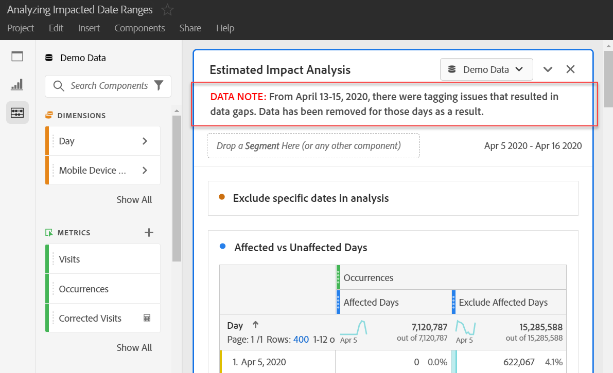

# Informera användarna om händelseeffekter

Om du har data som [påverkas av en händelse](overview.md) är det viktigt att kommunicera den händelsen till användarna i din organisation.

* Utveckla en gemensam ansvarsfriskrivning som du kan använda i kommunikationen för att uppnå enhetlighet
* Kommunicera kontinuerligt till Analytics-användare och viktiga intressenter under och efter evenemanget
* Placera en påminnelse i kalendern för efterföljande milstolpar, t.ex. följande månad eller år. Den här informationen kan i framtiden hjälpa till att påminna användare som tittar på rapporter om effekten i månads- eller årsrapporter.

I Adobe Analytics visas olika sätt att kommunicera med användare i organisationen i följande avsnitt. Du kan även använda andra metoder utanför Adobe Analytics, till exempel e-post, för att kommunicera med användare.

## Kommunicera via paneler eller visualiseringsbeskrivningar

Om du har ett Workspace-projekt som delas mellan användare i organisationen kan du förmedla effekten av en händelse via paneler eller visualiseringsbeskrivningar. Högerklicka på en panel eller ett visualiseringshuvud och välj sedan **[!UICONTROL Edit description]**.

## Kommunicera med textvisualiseringar

Du kan också förmedla påverkan av en händelse genom dedikerade textvisualiseringar. Se [Textvisualiseringar](/help/analyze/analysis-workspace/visualizations/text.md) i användarhandboken för Analysera.

## Lägga till anpassade kalenderhändelser i trender i Workspace

För all visualisering i Workspace kan du lägga till i en serie som representerar det datumintervall som påverkas.

1. Skapa ett beräknat mått med segmentet Påverkade dagar genom att följa [Uteslut specifika datum i analysen](segments.md).
1. Lägg till det önskade måttet på den beräknade mätarbetsytan.

   

1. Lägg till en titel och en beskrivning som informerar användarna om effekten. Du kan också tagga det här måttet som en kalenderanteckning om du vill.

   

1. I ett frihandsbord lägger du till dimensionen &#39;Dag&#39;. Lägg till &#39;Besök&#39; och ditt beräknade mått som kolumner sida vid sida.

   

1. Klicka på kugghjulsikonen för kolumninställningar för det beräknade måttet och aktivera **[!UICONTROL Interpret zero as no value]**.

   

1. Lägg till en linjevisualisering. Dagar som påverkas representeras med en annan färg. Användarna kan också klicka på ikonen Info i det beräknade måttet för mer information.

   

