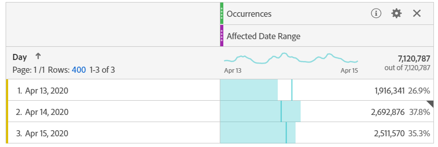
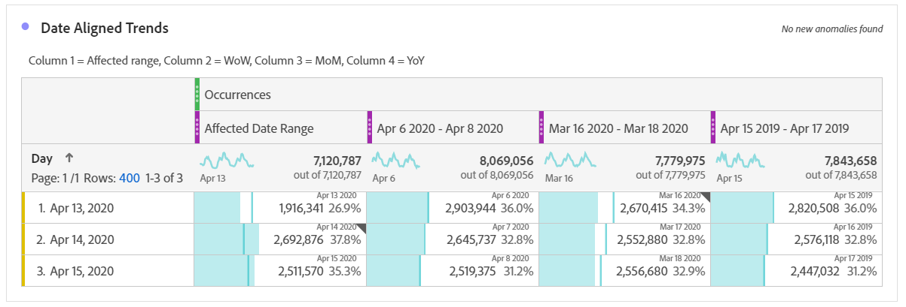

# Jämför datum som påverkas av en händelse med tidigare intervall

Om du har data som [påverkas av en händelse](overview.md) kan du titta på historiska trender för att mäta dess påverkan. Jämförelsen är värdefull för att förstå hur mycket en händelse påverkar dina data, så att du kan bestämma om du vill exkludera data, lägga till en anteckning till rapporter eller ignorera dem.

## Skapa ett datumintervall som inkluderar händelsen

Skapa ett datumintervall som omfattar händelsen för att börja utforska effekten av den händelsen.

1. Navigera till **[!UICONTROL Components]** > **[!UICONTROL Date ranges]**.
2. Klicka på **[!UICONTROL Add]**.
3. Välj det datumintervall där händelsen inträffade. Klicka på **[!UICONTROL Save]**.

   

## Visa händelsedatum och liknande tidigare intervall sida vid sida

Du kan jämföra alla mått mellan datumintervallet för händelsen med liknande tidigare datumintervall med hjälp av en frihandsritad tabellvisualisering.

1. Öppna ett Workspace-projekt och lägg till Dag-dimensionen i frihandsregistret. Använd det nyligen skapade datumintervallet som är staplat på ett mätvärde, till exempel &#39;Förekomster&#39;.

   

2. Högerklicka på datumintervallet och klicka sedan på **[!UICONTROL Add time period column]** > **[!UICONTROL Custom date range to this date range]**.
   * Om du vill göra en jämförelse mellan vecka och vecka väljer du intervallet för händelsen minus 7 dagar. Kontrollera att veckodagarna mellan händelsen och datumintervallet är justerade.
   * För en månadsvis jämförelse väljer du intervallet för händelsen förra månaden. Du kan också välja intervallet för händelsen minus 28 dagar om du vill justera veckodagarna.
   * För en jämförelse mellan år och år väljer du intervallet för händelsen förra året.
3. När du väljer önskat datumintervall läggs de till i frihandstabellen. Du kan högerklicka och lägga till så många datumintervall som du vill jämföra.

   

## Beräkna procentskillnader mellan händelsen och liknande tidigare intervall

Jämför dimensionsobjekt mellan en händelses datumintervall och liknande tidigare datumintervall med hjälp av en frihandsvisualisering. De här stegen illustrerar ett vecko-över-vecka-exempel du kan följa.

1. Öppna ett Workspace-projekt och lägg till en **icke-tidsdimension** i frihandstabellen. Du kan till exempel använda dimensionen &quot;Mobilenhetstyp&quot;. Använd det nyligen skapade datumintervallet som är staplat på ett mätvärde, till exempel &#39;Förekomster&#39;:

   

2. Högerklicka på datumintervallet och klicka sedan på **[!UICONTROL Compare time periods]** > **[!UICONTROL Custom date range to this date range]**. Välj intervallet för händelsen minus 7 dagar. Kontrollera att veckodagarna mellan händelsen och datumintervallet är justerade.

   

3. Byt namn på det resulterande procentvärdet till något mer specifikt, till exempel &quot;WoW Affected Range&quot;. Klicka på informationsikonen och klicka sedan på redigeringspennan för att redigera måttets namn.

   

4. Upprepa steg 3 och 4 för månads- och årsjämförelser. Du kan utföra den här åtgärden i samma tabell eller i separata tabeller.

## Analysera datumintervall för jämförelse sida vid sida som rader

Om du vill analysera ändringarna i procent ytterligare kan du konvertera dem till rader.

1. Lägg till en frihandsritbordsvisualisering och aktivera tabellverktyget. Med den här åtgärden kan du placera procentvärdena för ändring i önskad ordning.
2. Håll ned `Ctrl` (Windows) eller `Cmd` (Mac) och dra 3-procentsvärdena för ändring till tabellraderna, en åt gången.

   

3. Lägg till segmentet&quot;Alla besök&quot; i tabellkolumnen och eventuella andra önskade segment.

   

4. Klicka på **[!UICONTROL Build]**. I den resulterande tabellen kan du visa de berörda intervallen mot föregående vecka, månad och år för alla önskade segment.

   
