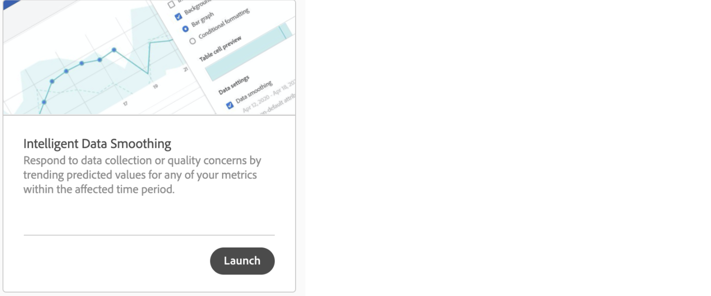
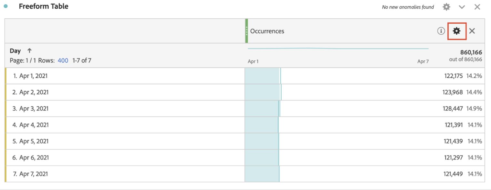

# Intelligent datautjämning

I enstaka fall kan vissa faktorer påverka datakvaliteten. Punkttrafik, implementeringsändringar eller driftavbrott kan påverka integriteten hos insamlade data. De komplicerar också analysen av hur händelsen kan ha påverkat informationens fullständighet.

Intelligent datautjämning är en prototyp i [Analytics Labs](/help/analyze/labs.md) som kan bidra till att slutföra den här vyn genom att analysera historiska trender för att förutsäga värdet av mätvärden inom den berörda tidsperioden. Prototypen använder avancerade maskininlärningsalgoritmer för att kartlägga de förväntade värdena för mätvärden under den tidsperiod som analyseras.

## Kör intelligent datautjämning

1. Gå till Adobe Analytics Labs:
   
1. Starta prototypen Intelligent Data Smoothing.
   
1. Lägg till mätvärden som måste analyseras i frihandstabellen. Prototypen fungerar bara med daglig granularitet, så se till att dimensionen i tabellen är Dag.
   
1. Välj ett datumintervall som är bredare än händelsens fönster men se till att det innehåller händelsen.
   
1. Klicka på kugghjulsikonen för måttet i frihandstabellen.
   
1. Under [!UICONTROL Data Settings]väljer du [!UICONTROL Data smoothing] alternativ.
   
1. Välj det datum/datumintervall som motsvarar händelsen och klicka på [!UICONTROL Apply].
Se till att dataområdet för Datautjämning är en delmängd av det datumintervall som har valts för panelen. Måtten i tabellen och diagrammet ersätts av de förväntade värdena.
   
