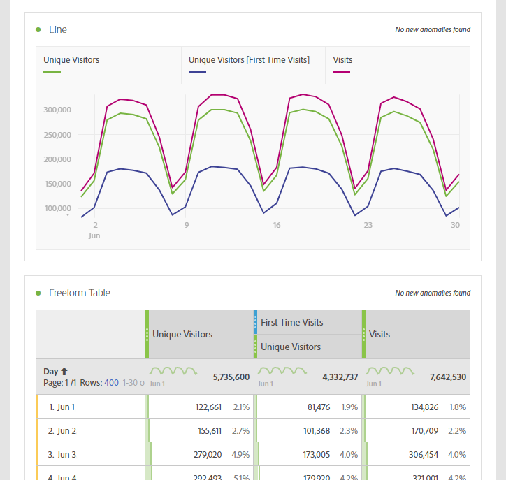

# Vanliga mätvärden på andra plattformar - översättningsguide

På andra plattformar som Google Analytics har många rapporter ett gemensamt antal mätvärden. Använd den här sidan om du vill veta hur du återskapar mätvärden som används i många rapporter.

Om du vill lägga till flera mätvärden i en frihandstabell på arbetsytan drar du mätvärdena från komponentområdet bredvid måttrubriken på arbetsytan:

## Förvärvsstatistik

**Användare** är ungefär lika med **Unika besökare** i Workspace. Mer information finns i måttet [Unika besökare](/help/components/metrics/unique-visitors.md) i användarhandboken för komponenter.

**Nya användare** kan hämtas av följande:

1. Dra måttet **Unika besökare** till arbetsytan.
2. Dra segmentet **Första gången du besöker** ovanför mätrubrikerna för unika besökare:

   

**Sessioner** är ungefär lika med **Besök** i Analysis Workspace. Mer information finns i måttet [Besök](/help/components/metrics/visits.md) i användarhandboken för komponenter.

## Beteendemått

**Studsfrekvens** är tillgängligt i Analysis Workspace som mått. Mer information finns i [Studsfrekvensen](/help/components/metrics/bounce-rate.md) i användarhandboken för komponenter.

**Sidor/session** är ett beräknat mått. Den kan erhållas genom följande:

1. Om du redan har skapat det här beräknade måttet letar du reda på det under Metrisk och drar det till arbetsytan.
2. Om du ännu inte har skapat det här beräknade måttet klickar du på ikonen **+** nära måttlistan för att öppna verktyget för beräkning.
3. Ge den titeln &quot;Sidvisningar per besök&quot; och en beskrivning om så önskas.
4. Ställ in formatet till Decimal och ställ in antalet decimaler till 2.
5. Dra måtten **Sidvyer** och **Besök** till definitionsområdet.
6. Ordna definitionen så att formeln är **Sidvyer delade med Besök**.

   

7. Klicka på Spara för att gå tillbaka till arbetsytan.
8. Dra det nydefinierade beräknade måttet till arbetsytan.

   Läs mer om [Beräknade mått](/help/components/c-calcmetrics/cm-overview.md) i användarhandboken för komponenter.

**Medel. Sessionstiden** är ungefär lika med **den tid som tillbringats per besök (sekunder)**. Läs mer om [Tid per besök](/help/components/metrics/time-spent-per-visit.md) i användarhandboken för komponenter.

## Konverteringsmått

**Målkonverteringsgrad**, **Målslutföranden** och **Målvärde** kräver ytterligare implementering på båda plattformarna. Om din implementering redan innehåller funktioner för produktdimensionen och inköpshändelsen ska du göra följande:

1. Dra måtten **Beställningar**, **Intäkter** och **Besök** till arbetsytan.
1. Skapa ett beräknat mått på **Beställningar per besök**. Markera båda mätrubrikerna genom att Ctrl-klicka (Windows) eller Kommando-klicka (Mac). Högerklicka på någon av rubrikerna, välj **Skapa mätvärden från markering** och klicka sedan på **Dela**. Det nya måttet liknar en konverteringsgrad för mål.
1. Om du behöver använda decimaler redigerar du det beräknade måttet. Klicka på knappen Info i måtthuvudet och sedan på pennikonen. Lägg till 1 eller 2 decimaler i fönstret Beräknad metrisk byggare och klicka sedan på Spara.

   

Om implementeringen ännu inte klarar produkt- eller konverteringsdata rekommenderar Adobe att man samarbetar med en implementeringskonsult för att säkerställa datakvalitet och dataintegritet.
